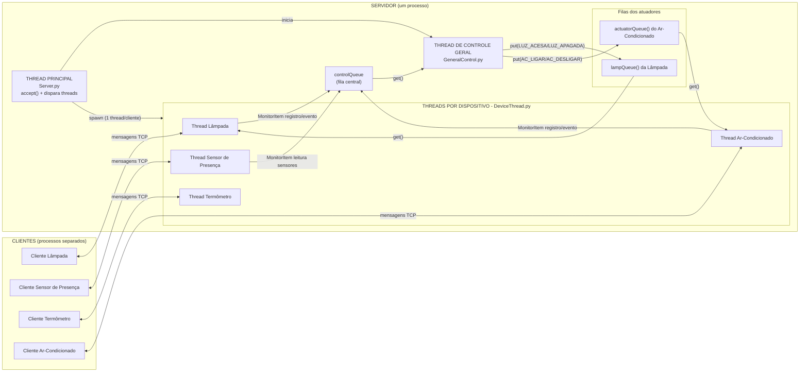
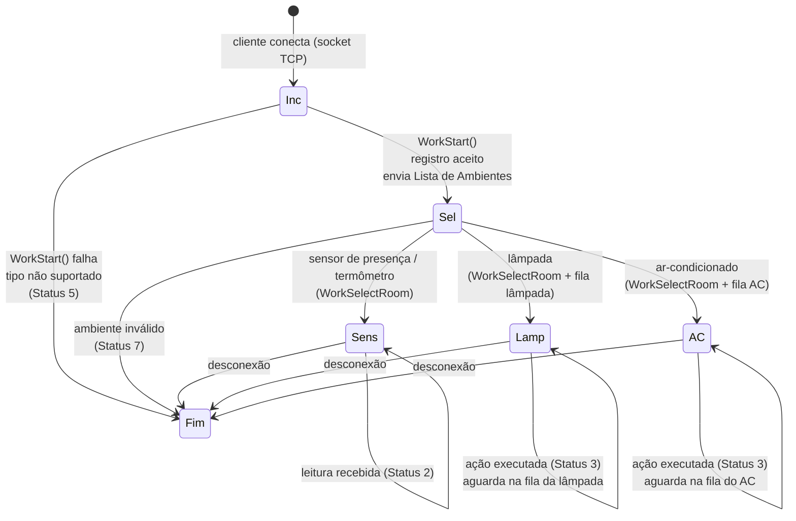
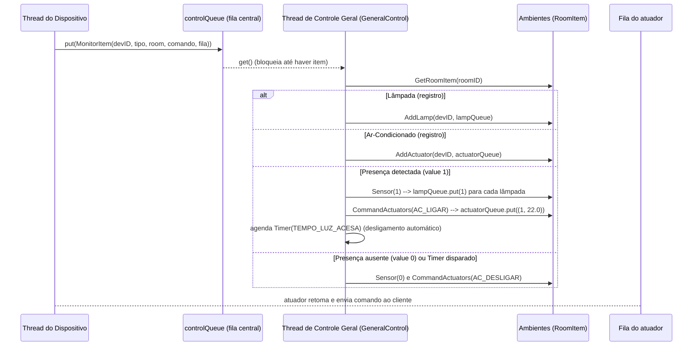
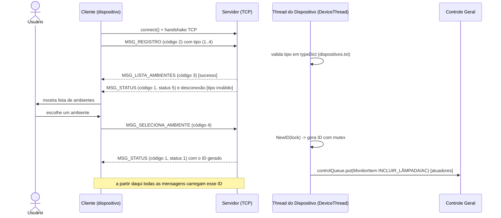
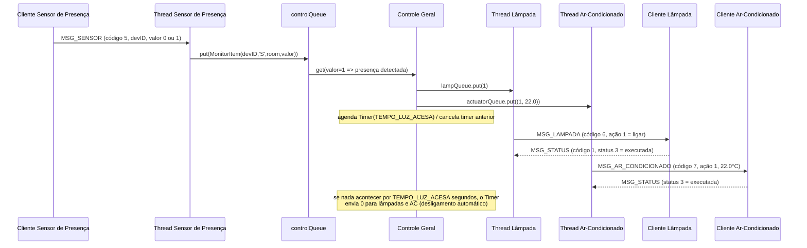
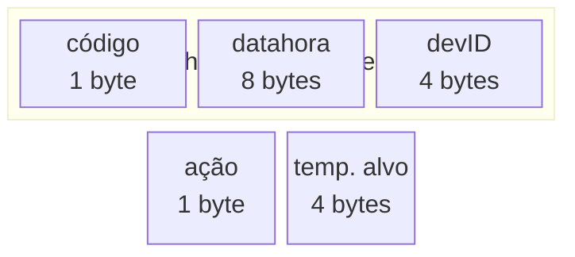

# Smart Home sobre Sockets TCP
**Trabalho de Sockets — Disciplina: Redes de Computadores (PPComp)**
**Autor: Petar Veljovic**

Sistema **Cliente/Servidor** em Python que controla dispositivos inteligentes de uma residência (lâmpadas, sensores de presença, termômetros e — **novo nesta versão** — ar-condicionado inteligente). O servidor é o centro de controle da casa, gerencia os ambientes, mantém uma conexão TCP ativa com cada dispositivo e é **multithread**. A comunicação obedece a um **protocolo binário de tamanho fixo**, definido com a biblioteca `struct` (big-endian).

| Item | Valor |
|------|-------|
| Linguagem | Python 3.6+ (testado em 3.10) |
| Módulos usados | `socket`, `threading`, `queue`, `struct`, `ctypes`, `datetime` |
| Transporte | TCP (socket de fluxo), big-endian |
| Porta padrão | `5000` (`localhost`) |
| Mensagens | Binárias, primeiro byte = código (define o tamanho da mensagem) |
| Concorrência | 1 thread por dispositivo + 1 thread de controle geral + filas (`queue.Queue`) |

---

## Sumário

1. [Visão geral do repositório](#1-visão-geral-do-repositório)
2. [Fundamentos de Sockets TCP](#2-fundamentos-de-sockets-tcp)
3. [Arquitetura e diagramas de fluxo](#3-arquitetura-e-diagramas-de-fluxo)
4. [O protocolo de comunicação](#4-o-protocolo-de-comunicação)
5. [Roteiro detalhado de testes](#5-roteiro-detalhado-de-testes)
6. [Extensão: Ar-Condicionado Inteligente](#6-extensão-ar-condicionado-inteligente)
7. [Análise crítica: bugs e melhorias](#7-análise-crítica-bugs-e-melhorias)
8. [Referências](#8-referências)

---

## 1. Visão geral do repositório

```
atividadecristinaredes/
├── README.md                       # este documento (núcleo da entrega)
├── gabarito/                       # CÓDIGO ORIGINAL, exatamente como fornecido
│   ├── Server.py                   #   (base para o commit 1 do repositório)
│   ├── GeneralControl.py
│   ├── DeviceThread.py
│   ├── Message.py
│   ├── ControlItem.py
│   ├── Device.py
│   ├── Config.py
│   ├── ClientUtil.py
│   ├── Cliente_Lampada.py
│   ├── Cliente_Presenca.py
│   ├── Cliente_Temperatura.py
│   ├── ambientes.txt
│   └── dispositivos.txt
├── src/                            # SISTEMA EM EVOLUÇÃO (extensão + correções)
│   ├── (mesmos arquivos do gabarito, mais:)
│   ├── Cliente_ArCondicionado.py   #   -> novo dispositivo implementado
│   └── dispositivos.txt            #   -> inclui o tipo 4 (Ar-Condicionado)
├── scripts/
│   ├── run_demo.py                 # gera os logs de demonstração/teste (full, unsupported, invalid_room, invalid_byte, partial_list)
│   ├── test_buffer_tcp.py          # prova o tratamento do buffer TCP (fragmentação/coalescência)
│   └── test_unsolicited.py         # prova o efeito de mensagem não solicitada (seção 7.4)
├── docs/
│   ├── Documentacao.pdf            # documentação original (anexo)
│   ├── Fluxogramas.pptx            # fluxogramas originais (anexo)
│   └── testes/                     # printscreens (logs reais) de cada etapa
│       ├── gabarito/               #   comportamento do código original
│       ├── src/                    #   comportamento do sistema corrigido/estendido
│       └── tcp_buffer/             #   log do teste de fragmentação/coalescência
└── .gitignore
```

**Granularidade de versionamento (sugestão de commits lógicos):**

1. `gabarito/` — código original, **exatamente como fornecido** (primeiro commit).
2. `docs/` — anexos (`Documentacao.pdf` e `Fluxogramas.pptx`).
3. `src/` — correção dos bugs críticos (seção [7](#7-análise-crítica-bugs-e-melhorias)).
4. `src/` — extensão: **Ar-Condicionado Inteligente** (protocolo + servidor + cliente).
5. Melhorias (timer de desligamento automático), `scripts/` e `README.md`.

A pasta `gabarito/` fica intocada: ela permite comparar *antes/depois* (ver seção
[7](#7-análise-crítica-bugs-e-melhorias)) e é a cópia fiel que deve compor o primeiro commit.

> Todos os "printscreens" deste documento são **capturas reais** dos terminais,
> geradas executando o próprio sistema (cliente e servidor) em TCP local. Os
> arquivos originais ficam em `docs/testes/`.

---

## 2. Fundamentos de Sockets TCP

### 2.1 O que é um socket?

Um **socket** é a interface que o sistema operacional oferece aos programas para
enviarem e receberem dados através da rede. Na prática, é a "porta" entre o processo
(seu programa) e a pilha de protocolos TCP/IP do sistema operacional.

```
        Aplicação A                                    Aplicação B
   ┌──────────────────┐                          ┌──────────────────┐
   │  socket (fd)     │                          │  socket (fd)     │
   └────────┬─────────┘                          └────────┬─────────┘
            │                                          │
   ┌────────▼─────────┐                          ┌──────▼─────────┐
   │ Pilha TCP/IP (SO)│── router/rede/hosts ────▶│ Pilha TCP/IP   │
   └──────────────────┘                          └────────────────┘
```

No código, o servidor cria o socket assim (`Server.py`):

```python
tcp = socket.socket(socket.AF_INET, socket.SOCK_STREAM)   # IPv4 + TCP
tcp.bind((SERVIDOR, PORTA))                               # associa à porta 5000
tcp.listen(5)                                             # entra em modo "escuta"
connection, clientIP = tcp.accept()                       # aceita um cliente
```

E o cliente (`ClientUtil.py` / `Cliente_Lampada.py`):

```python
connection = socket.socket(socket.AF_INET, socket.SOCK_STREAM)
connection.connect((SERVIDOR, PORTA))
```

### 2.2 TCP: um "riacho de bytes" (byte stream)

TCP é um protocolo **orientado à conexão**, **confiável** e **full-duplex**:

- *Orientado à conexão*: antes de trocar dados, cliente e servidor executam o
  *three-way handshake* (`SYN`, `SYN+ACK`, `ACK`);
- *Confiável*: garantir entregas, em ordem e sem duplicação (retransmissões,
  janelas de congestionamento, checksum);
- *Full-duplex*: os dois lados podem enviar e receber ao mesmo tempo.

A característica mais importante para este trabalho: **TCP não preserva limites de
mensagens**. Ele entrega um fluxo contínuo (stream) de bytes, mas não informa onde
"termina" a mensagem que um programa chamou com `send()`.

### 2.3 O buffer TCP e por que `send()` ≠ `recv()`

Quando uma aplicação chama `send(buffer)`, a pilha TCP copia esses bytes para o
**buffer de envio** do socket. A partir daí quem decide como enviar é o protocolo,
de acordo com:

- o **MSS/MTU** da rede (tamanho máximo de um segmento);
- a **janela de congestionamento e a janela de recepção** (quantos bytes podem
  estar "em voo" / o receptor pode absorver);
- o **algoritmo de Nagle** e a agregação (coalescing) da pilha;
- o agendamento da rede e eventuais **retransmissões**.

Resultado: **não existe a garantia de que cada `send()` do remetente corresponde a
exatamente um `recv()` no destinatário.** Temos dois fenômenos clássicos:

**Fenômeno 1 — Fragmentação (splitting):** uma única chamada `send()` de 10 bytes
pode chegar em vários pedaços, porque os segmentos são limitados pelo MSS ou porque
o receptor executa vários `recv()` antes de a mensagem completa estar disponível.

```
Cliente envia 10 bytes (1 mensagem de Registro)

   send() -> ┌──┬──────────────────────┬──┐
             │ 2│   datahora (8 bytes) │ 1│        10 bytes
             └──┴──────────────────────┴──┘

Podem chegar ao servidor assim:

   recv() #1 ->  | 02 41 DA A9 B8 9F 12 87 |   (8 bytes)
   recv() #2 ->  | 4D 01                  |   (2 bytes)
```

**Fenômeno 2 — Coalescência (agrupamento):** várias chamadas `send()` consecutivas
podem ser entregues ao destinatário em **um único** `recv()`.

```
Cliente faz send() de 2 mensagens de leitura (17 + 17 = 34 bytes)

   send() #1 -> |05| datahora| devID | valor|   (17 bytes)
   send() #2 -> |05| datahora| devID | valor|   (17 bytes)

O servidor pode receber:

   recv() 1 -> |05|...| valor |05| ...| valor |   (34 bytes, tudo de uma vez)
```

### 2.4 Por que o código precisa "tratar o recebimento" das mensagens

Se cada `send()` pode virar "vários recv()" e vários `send()` podem virar "um único
recv()", a aplicação não pode simplesmente fazer:

```python
# PERIGOSO: NÃO é assim que funciona!
msg = connection.send(dados)      # 1 send  -> ok
dados = connection.recv(1024)     # pressupõe que 1 recv == 1 mensagem  ❌
```

Isso quebra nos dois sentidos:

- se a mensagem chegou **fracionada**, um único `recv()` devolve só um pedaço
  (a mensagem seria decodificada de forma errada);
- se **várias mensagens chegaram juntas**, o primeiro `recv()` pode devolver "mais de
  uma mensagem" e o **restante ficaria perdido/pertencente à próxima leitura**.

**A solução usada no sistema é composta de duas partes:**

1. **Buffer acumulativo por conexão** — todo byte recebido é *anexado* a
   `device.buffer`, nunca sobrescrito:

   ```python
   device.buffer = device.buffer + dataBin        # Message.ReceiveMessage
   ```

2. **Enquadramento baseado no tamanho (framing fixo)** — como **o primeiro byte de
   cada mensagem é o código da mensagem** e cada código tem tamanho conhecido, o
   decodificador só "consome" a mensagem quando há bytes suficientes no buffer:

   ```python
   def getMessage(buffer):
       codeBin = buffer[:1]
       code, = struct.unpack('!B', codeBin)     # 1º byte = código
       msgsSize = [15,10,11,11,17,14,18]        # tamanho de cada tipo
       msgSize = msgsSize[code-1]
       if len(buffer) < msgSize:
           return None, buffer                  # incompleta: aguardar mais bytes
       msgData = buffer[:msgSize]               # recorta SÓ a mensagem inteira
       buffer = buffer[msgSize:]                # guarda o resto no buffer
       ...
   ```

   O que sobra no buffer (`buffer[msgSize:]`) permanece acumulado — pode conter o
   "início" da próxima mensagem que ainda está chegando, **ou duas mensagens inteiras
   que vieram juntas no mesmo segmento TCP**.

> **Evidência prática (gerada pelo próprio sistema):** o script
> `scripts/test_buffer_tcp.py` executa dois cenários reais contra o servidor:
>
> - **Fragmentação:** envia um `Registro` (10 bytes) em 3 pedaços, com intervalos
>   (`1 byte`, `2 bytes`, `7 bytes`). O log do servidor mostra o decodificador
>   tentando "3 vezes" (uma por fragmento recebido) até a mensagem estar completa:
>
>   ```text
>   >>> Aguardando mensagem
>   >>> Decodificando mensagem...
>   >>> Decodificando mensagem...
>   >>> Decodificando mensagem...
>   Mensagem recebida:  ('127.0.0.1', 57948) [09/13/2026, 14:57:23] 2: Registro, Tipo de dispositivo: 3
>   ```
>
> - **Coalescência:** envia **duas** leituras de sensor (`17 + 17 = 34 bytes`) em um
>   único `sendall()`. O servidor separa as duas e responde com dois `Status`:
>
>   ```text
>   Mensagem recebida:  ... 5: Leitura, Dispositivo: 1, Valor do sensor: 26.5
>   Mensagem recebida:  ... 5: Leitura, Dispositivo: 1, Valor do sensor: 27.5
>   ```
>
> Os logs completos estão em `docs/testes/tcp_buffer/` e o resultado do script é:
>
> ```text
> TESTE 1 - FRAGMENTACAO: registro enviado em 3 pedacos ... OK
> TESTE 2 - COALESCENCIA: duas leituras em um UNICO sendall() ... OK
> ```

---

## 3. Arquitetura e diagramas de fluxo

O sistema executa com **4 papéis de execução** no servidor, além dos clientes:

1. **Thread Principal** (`Server.py`): carrega as tabelas, dispara a thread de
   controle geral, coloca a porta em `LISTEN` e fica em loop aceitando conexões.
   Para cada conexão, cria uma **thread própria para aquele dispositivo**.
2. **Threads por dispositivo** (`DeviceThread.py`): uma por cliente conectado.
   Implementam uma **máquina de estados** de comunicação (registro → seleção de
   ambiente → conectado) e traduzem bytes/mensagens, sempre usando o buffer.
3. **Thread de Controle Geral** (`GeneralControl.py`): coleta os eventos da casa
   através de uma **fila central** (`controlQueue`) e coordena os atuadores
   (lâmpadas, ar-condicionados) de cada ambiente.
4. **Filas (`queue.Queue`)** — a **ponte assíncrona** entre threads:
   - `controlQueue`: thread de dispositivo → controle geral;
   - `lampQueue` / `actuatorQueue` (uma por atuador): controle geral → thread do atuador.

### 3.1 Diagrama geral: threads, filas e troca de mensagens



### 3.2 Thread Principal

```python
while True:
    connection, clientIP = tcp.accept()               # bloqueia até chegar cliente
    print('Cliente conectado:', clientIP)
    threading.Thread(target=DeviceThread,             # 1 thread por cliente
                     args=(connection, clientIP, controlQueue,), daemon=True).start()
```

Ela não conversa com o dispositivo: apenas aceita a conexão, passa o **socket** e o
destino da **fila de controle** para a nova thread, que passa a ser a "responsável"
por aquele dispositivo até desconectar.

### 3.3 Thread por dispositivo: a máquina de estados

Cada thread segue a máquina de estados abaixo (estados `SM_*` de `Config.py`):



Pontos importantes:

- `WorkStart` valida o tipo do dispositivo consultando a tabela carregada de
  `dispositivos.txt`. Se o tipo **não existe**, envia `Status [5]` e encerra.
- `WorkSelectRoom` valida o ambiente, gera o **ID** com exclusão mútua
  (`NewID(lock)` — evita condição de corrida), responde `Status [1]` com o ID e,
  para atuadores (lâmpada/AC), **cria uma fila** e registra o atuador no ambiente
  via `controlQueue`.
- Threads de atuador ficam **bloqueadas na própria fila** (aguardando comandos do
  controle geral), e só usam a rede TCP quando precisam *enviar* o comando ao
  cliente (e ler a confirmação `Status [3]`).

### 3.4 Thread de Controle Geral + filas (queues)



A fila soluciona o **desacoplamento e a sincronização** entre threads:

- A thread do sensor **não executa** o acionamento da lâmpada; ela apenas *publica*
  o evento. Quem decide é a **única** thread de controle, evitando acesso
  simultâneo às listas de dispositivos de um ambiente.
- Duas threads de sensor nunca "brigam" pelos atuadores: a `get()` da fila é
  atômica e libera os eventos um a um.
- A fila também **entrega** o comando ao atuador: a thread da lâmpada fica ociosa em
  `lampQueue.get()` (sem gastar CPU) até chegar uma ação.

### 3.5 Sequência de registro de um dispositivo (fluxo completo)



### 3.6 Fluxo do sensor de presença → lâmpada e ar-condicionado



### 3.7 Relação com o anexo `Fluxogramas.pptx`

O anexo traz 5 diagramas (thread do servidor, temperatura, presença, lâmpada e o
fluxo do controle geral). Este README **aprimora** esses diagramas de três formas:

1. **Padroniza a notação**: os fluxogramas do anexo misturam legenda de "chamada a
   outro fluxograma", "instrução" e "mensagem". Aqui os diagramas são convertidos
   para *flowchart*, *state diagram* e *sequence diagram*, separando claramente:
   **processos** (caixas), **threads** (agrupamentos), **filas** (pipeline) e
   **mensagens TCP** (setas entre processos).
2. **Acrescenta o novo dispositivo** (Ar-Condicionado) ao diagrama do servidor.
3. **Explicita o desacoplamento por filas**: nos originais a "FILA" aparece como
   elemento; aqui mostramos *quem publica* e *quem consome* em cada fila, e o papel
   do `queue.Queue` na sincronização das threads.

---

## 4. O protocolo de comunicação

### 4.1 Convenções

- **Endianness:** todos os campos numéricos são **big-endian** (rede). Em Python,
  isso é feito com o prefixo `!` das máscaras `struct`.
- **Data e hora:** `double` com *Unix timestamp* (segundos desde 01/01/1970),
  gerado por `datetime.timestamp(datetime.now())`.
- **Formato:** todas as mensagens são **múltiplas de 1 byte** e começam pelo
  **código da mensagem** (1 byte). A partir do código, o receptor calcula o
  **tamanho exato** da mensagem — isso permite o enquadramento descrito em
  [2.4](#24-por-que-o-código-precisa-tratar-o-recebimento-das-mensagens).

| Máscara | Significado |
|---------|-------------|
| `B` | `unsigned char` (1 byte, inteiro sem sinal) |
| `d` | `double` (8 bytes) |
| `H` | `unsigned short` (2 bytes) |
| `I` | `unsigned int` (4 bytes) |
| `f` | `float` (4 bytes) |
| `20s` | string fixa de 20 bytes |

### 4.2 Tabela-resumo das mensagens

| # | Constante | Sentido | Máscara | Tamanho |
|---|-----------|---------|---------|:-------:|
| 1 | `MSG_STATUS` | ambos | `!BdIH` | **15** |
| 2 | `MSG_REGISTRO` | cliente → servidor | `!BdB` | **10** |
| 3 | `MSG_LISTA_AMBIENTES` | servidor → cliente | `!BdH` + N×`!H20s` | **11 + 22×N** |
| 4 | `MSG_SELECIONA_AMBIENTE` | cliente → servidor | `!BdH` | **11** |
| 5 | `MSG_SENSOR` | cliente → servidor | `!BdIf` | **17** |
| 6 | `MSG_LAMPADA` | servidor → cliente | `!BdIB` | **14** |
| 7 | `MSG_AR_CONDICIONADO` *(novo)* | servidor → cliente | `!BdIBf` | **18** |

### 4.3 [1] `MSG_STATUS` — código **1**, 15 bytes

Estado resultante de uma operação, enviado **nos dois sentidos**.

| Posição | Campo | Tipo | Bytes | Conteúdo |
|:-------:|-------|------|:-----:|----------|
| 0 | código | `B` | 1 | fixo = **1** |
| 1 | datahora | `d` | 8 | Unix timestamp |
| 9 | devID | `I` | 4 | ID do dispositivo |
| 13 | status | `H` | 2 | código de status (tabela abaixo) |

| status | Constante | Significado |
|:------:|-----------|-------------|
| 1 | `DISPOSITIVO_REGISTRADO` | dispositivo registrado (envia o ID) |
| 2 | `LEITURA_RECEBIDA` | valor de leitura recebido |
| 3 | `ACAO_EXECUTADA` | ação executada |
| 4 | `ERRO_DISPOSITIVO_NAO_REGISTRADO` | dispositivo ainda não registrado |
| 5 | `ERRO_DISPOSITIVO_NAO_SUPORTADO` | tipo de dispositivo não suportado |
| 6 | `ERRO_FORMATO_MENSAGEM_INVALIDA` | formato de mensagem inválido |
| 7 | `ERRO_AMBIENTE_INVALIDO` | ambiente selecionado inválido |
| 8 | `ERRO_ID_DE_DISPOSITIVO_INVALIDO` | ID de dispositivo inválido |
| 9 | `ERRO_ACAO_NAO_SUPORTADA` | ação não suportada |
| 10 | `ERRO_MENSAGEM_NAO_ESPERADA` | mensagem não esperada |
| 11 | `ERRO_COMUNICACAO` | falha de rede |

### 4.4 [2] `MSG_REGISTRO` — código **2**, 10 bytes

Enviado pelo cliente **assim que conecta**, informando o tipo do dispositivo.

| Posição | Campo | Tipo | Bytes | Conteúdo |
|:-------:|-------|------|:-----:|----------|
| 0 | código | `B` | 1 | fixo = **2** |
| 1 | datahora | `d` | 8 | Unix timestamp |
| 9 | devTipo | `B` | 1 | **1** Lâmpada · **2** Sensor Presença · **3** Termômetro · **4** Ar-Condicionado |

### 4.5 [3] `MSG_LISTA_AMBIENTES` — código **3**, 11 + 22×N bytes

Enviada pelo servidor quando o tipo é aceito. É a **única mensagem de tamanho
variável** do protocolo.

| Posição | Campo | Tipo | Bytes | Conteúdo |
|:-------:|-------|------|:-----:|----------|
| 0 | código | `B` | 1 | fixo = **3** |
| 1 | datahora | `d` | 8 | Unix timestamp |
| 9 | numAmbientes (N) | `H` | 2 | quantidade de ambientes |
| 11 | *item 1* | — | 22 | `H` (ID) + `20s` (nome) |
| ... | *item N* | — | 22 | `H` (ID) + `20s` (nome) |

> Os nomes ocupam **20 bytes fixos** e vêm preenchidos com `\x00` à direita; o
> decodificador remove esses nulos e espaços excedentes
> (`roomName.decode('UTF-8').replace('\x00', '').strip()`).

### 4.6 [4] `MSG_SELECIONA_AMBIENTE` — código **4**, 11 bytes

| Posição | Campo | Tipo | Bytes | Conteúdo |
|:-------:|-------|------|:-----:|----------|
| 0 | código | `B` | 1 | fixo = **4** |
| 1 | datahora | `d` | 8 | Unix timestamp |
| 9 | ambID | `H` | 2 | ID do ambiente escolhido |

### 4.7 [5] `MSG_SENSOR` — código **5**, 17 bytes

Usada por termômetros (valor = temperatura) e sensores de presença (0 ou 1).

| Posição | Campo | Tipo | Bytes | Conteúdo |
|:-------:|-------|------|:-----:|----------|
| 0 | código | `B` | 1 | fixo = **5** |
| 1 | datahora | `d` | 8 | Unix timestamp |
| 9 | devID | `I` | 4 | ID do dispositivo |
| 13 | valor | `f` | 4 | leitura (float) |

### 4.8 [6] `MSG_LAMPADA` — código **6**, 14 bytes

Comando de atuação da lâmpada, **sempre enviado pelo servidor**.

| Posição | Campo | Tipo | Bytes | Conteúdo |
|:-------:|-------|------|:-----:|----------|
| 0 | código | `B` | 1 | fixo = **6** |
| 1 | datahora | `d` | 8 | Unix timestamp |
| 9 | devID | `I` | 4 | ID do dispositivo |
| 13 | ação | `B` | 1 | **0** desligar · **1** ligar |

### 4.9 [7] `MSG_AR_CONDICIONADO` — código **7** *(extensão)*, 18 bytes

Comando de atuação do ar-condicionado inteligente (novo dispositivo desta entrega).

| Posição | Campo | Tipo | Bytes | Conteúdo |
|:-------:|-------|------|:-----:|----------|
| 0 | código | `B` | 1 | fixo = **7** |
| 1 | datahora | `d` | 8 | Unix timestamp |
| 9 | devID | `I` | 4 | ID do dispositivo |
| 13 | ação | `B` | 1 | **0** desligar · **1** ligar |
| 14 | valor | `f` | 4 | temperatura alvo (usada ao ligar) |

> Todos os tamanhos estão **múltiplos de 1 byte** e seguem sempre a mesma ordem
> dos campos: **código da mensagem → data e hora → ID do dispositivo → campos
> específicos**, exatamente como exigido no enunciado.

### 4.10 Exemplo concreto (bytes capturados de uma execução real)

Registro de uma **Lâmpada** (`MSG_REGISTRO`, tipo 1 — 10 bytes):

```text
0000  02 41 DA A9 B8 9F 12 87   .A......
0008  4D 01                     M.
      │  └──────┬──────┘        └─┘
      │         │                 └─ devTipo = 0x01  (Lâmpada)
      │         └─ datahora (double, 8 bytes)
      └─ código = 0x02 (MSG_REGISTRO)
```

Leitura do **Termômetro** (`MSG_SENSOR`, 26,5 °C — 17 bytes):

```text
0000  05 41 DA A9 B8 9F 12 87   .A......
0008  4D 00 00 00 03  41 D4 00 00
            └──┬───┘   └──┬─────┘
               │          └─ valor = float 26.5
               └─ devID = 3
```

### 4.11 Ordem das trocas (quem fala primeiro?)

| Passo | Direção | Mensagem |
|:-----:|:-------:|----------|
| 1 | cliente → servidor | `MSG_REGISTRO` (código 2) |
| 2 | servidor → cliente | `MSG_LISTA_AMBIENTES` (código 3) — ou `MSG_STATUS` [5] + fim |
| 3 | cliente → servidor | `MSG_SELECIONA_AMBIENTE` (código 4) |
| 4 | servidor → cliente | `MSG_STATUS` [1] com o ID gerado — ou `MSG_STATUS` [7] + fim |
| 5 | laço contínuo | sensor: `MSG_SENSOR` → `MSG_STATUS` [2]; atuador: `MSG_LAMPADA`/`MSG_AR_CONDICIONADO` → `MSG_STATUS` [3] |

---

## 5. Roteiro detalhado de testes

Os logs abaixo foram **capturados executando o sistema real** (os arquivos
originais estão em `docs/testes/`). Para reproduzir manualmente, abra um terminal
para o servidor e um para **cada** cliente (5 terminais no total).

Os passos **manuais** (5.1 a 5.5) são executados **dentro da pasta `src/`**:

```powershell
cd src
```

Já os cenários **automatizados** (5.6 a 5.10) devem ser executados da **raiz do
repositório** (eles chamam `scripts/run_demo.py`). Quando estiver vindo dos passos
manuais, volte com `cd ..`.

### 5.0 Preparação

1. Verifique o Python (3.6 ou superior): `python --version`
2. Confirme os arquivos de configuração:
   - `ambientes.txt` — ID e nome de cada ambiente;
   - `dispositivos.txt` — tipos suportados (inteiros) e códigos (`L`, `S`, `T`, `A`);
   - `Config.py` — `SERVIDOR`, `PORTA`, `TAM_BUFFER`, `TEMPO_LUZ_ACESA`.
3. (Opcional) edite o `TEMPO_LUZ_ACESA` em `Config.py` para controlar o tempo de
   desligamento automático (o padrão é **5 segundos**, ideal para demonstração).

### 5.1 Passo 1 — Inicializar o servidor

```powershell
python Server.py
```

Resultado esperado:

```text
Inicializando o servidor
Carregando tabelas...
----------------------------------------------
Carregando tabela do sistema: ambientes.txt
----------------------------------------------
1 Sala
2 Quarto 1
... (15 ambientes)
----------------------------------------------

----------------------------------------------
Carregando tabela do sistema: dispositivos.txt
----------------------------------------------
1 Lâmpada
2 Sensor de Presença
3 Termômetro
4 Ar-Condicionado Inteligente
----------------------------------------------

Iniciando o controle.
+--------------------------------------------+
|  Trabalho 01 - Sockets                     |
|  Disciplina: Redes de Computadores PPComp  |
+--------------------------------------------+
Servidor inicializado.
Aguardando conexões dos dispositivos...
```

> **Log obrigatório:** o servidor precisa exibir a carga das duas tabelas e a
> mensagem "Aguardando conexões dos dispositivos...".

### 5.2 Passo 2 — Registrar uma Lâmpada

```powershell
python Cliente_Lampada.py
```

Escolha o ambiente digitando o número (ex.: `1` para Sala) e **`<ENTER>`**.

```text
Inicializando cliente: Lâmpada...
Dispositivo registrado
---------------------------------
Selecione o ambiente
1: Sala
2: Quarto 1
...
15: Copa
---------------------------------
ID do ambiente: 1
Dispositivo registrado: ID = 1

==> Ambiente [1] Sala
```

No servidor, observe o registro da lâmpada *no controle geral*:

```text
Cliente conectado: ('127.0.0.1', 57917)
...
Mensagem recebida:  ... 2: Registro, Tipo de dispositivo: 1
...: Dispositivo do tipo Lâmpada (L) registrado
Enviando mensagem:  ...
Lâmpada1: Ambiente selecionado = [1] Sala
Enviando mensagem de nova lâmpada para a fila do controle
Comando chegando na fila do controle do ambiente 1
Adicionando a lâmpada ID=1 no ambiente Sala
------------------------------------------------------
[1] Sala => Lâmpadas> 1
------------------------------------------------------
```

> **Log obrigatório:** "Adicionando a lâmpada ID=1 no ambiente Sala" e a listagem
> `[1] Sala => Lâmpadas> 1` impressa pela thread de controle.

### 5.3 Passo 3 — Registrar o Ar-Condicionado (novo dispositivo)

```powershell
python Cliente_ArCondicionado.py
```

```text
Inicializando cliente: Ar-Condicionado Inteligente...
Dispositivo registrado
---------------------------------
Selecione o ambiente
...
ID do ambiente: 1
Dispositivo registrado: ID = 2

==> Ambiente [1] Sala
```

O controle geral agora lista **os dois atuadores** do ambiente:

```text
Comando chegando na fila do controle do ambiente 1
Adicionando o ar-condicionado ID=2 no ambiente Sala
------------------------------------------------------
[1] Sala => Lâmpadas> 1 | Ar-Condicionados> 2
------------------------------------------------------
```

### 5.4 Passo 4 — Registrar o Termômetro e enviar temperaturas

```powershell
python Cliente_Temperatura.py
```

Digite o ambiente (`1`) e depois um valor numérico a cada prompt (aceita ponto ou
vírgula decimal). Para sair, `CTRL+X`.

```text
Inicializando cliente: Termômetro...
...
ID do ambiente: 1
Dispositivo registrado: ID = 3

==> Ambiente [1] Sala
Temperatura lida no sensor: 26
Meu ID=3
Enviando temperatura [09/13/2026, 14:55:41] 5: Leitura, Dispositivo: 3, Valor do sensor: 26.0
Aguardando confirmação...
Leitura recebida pelo servidor!!!
```

No servidor:

```text
Mensagem recebida:  ... 5: Leitura, Dispositivo: 3, Valor do sensor: 26.0
Termômetro3: VALOR LIDO DO SENSOR = 26.0
Enviando mensagem:  ('127.0.0.1', 57919)
```

> **Log obrigatório:** `VALOR LIDO DO SENSOR = <valor>` no servidor.

### 5.5 Passo 5 — Registrar o Sensor de Presença e acionar tudo

```powershell
python Cliente_Presenca.py
```

O cliente passa a oferecer as opções `0` (ninguém) e `1` (presença detectada).

```text
Inicializando cliente: Sensor de Presença...
...
ID do ambiente: 1
Dispositivo registrado: ID = 4

==> Ambiente [1] Sala
0) para indicar que o sensor não detectou ninguém
1) para indicar uma presença detectada
Selecione: 1
Meu ID=4
Status: Presença detectada
Enviando informação [09/13/2026, 14:55:43] 5: Leitura, Dispositivo: 4, Valor do sensor: 1
Aguardando confirmação...
Leitura recebida pelo servidor!!!

(no próximo teste)
Selecione: 1
Meu ID=4
Status: Presença detectada
Enviando informação ... Valor do sensor: 1
Leitura recebida pelo servidor!!!

(no teste final)
Selecione: 0
Meu ID=4
Status: Presença não detectada
Enviando informação ... Valor do sensor: 0
Leitura recebida pelo servidor!!!
```

No servidor, além da leitura, o controle geral **aciona os atuadores do ambiente**:

```text
Sensor de Presença4: VALOR LIDO DO SENSOR = 1.0
Enviando mensagem do sensor para a fila do controle
Lâmpada1: Acender lâmpada
Ar-Condicionado Inteligente2: Ligar ar-condicionado, temperatura alvo 22.0°C
```

E no cliente **Lâmpada**:

```text
Acionamento recebido do servidor!!!
#####################################
            LAMPADA LIGADA
#####################################
```

E no cliente **Ar-Condicionado**:

```text
Comando recebido do servidor!!!
#####################################
       AR-CONDICIONADO LIGADO
    Temperatura alvo: 22.0°C
#####################################
```

> **Log obrigatório:** no servidor, cada ack do atuador gera
> `Ação na lâmpada executada.` / `Ação no ar-condicionado executada.` e, nos
> clientes, `STATUS` de "ação executada" (código 3).

**Desligamento automático (novo):** se **nenhuma** nova presença for informada por
`TEMPO_LUZ_ACESA` segundos (padrão: 5 s), a thread de controle desliga os atuadores
sozinha:

```text
>>> Timer: sem movimento em [1] Sala por 5s. Desligando lâmpadas e ar-condicionados.
Lâmpada1: Apagar lâmpada
Ar-Condicionado Inteligente2: Desligar ar-condicionado
```

### 5.6 Passo 6 — Cenário de FALHA: tipo de dispositivo não suportado

Os clientes reais sempre informam um tipo válido. Para simular um registro inválido,
rode o cenário automatizado (que envia `MSG_REGISTRO` com tipo `99`):

```powershell
python scripts/run_demo.py --scenario unsupported --code-dir src --out-dir docs/testes/src
```

Cliente de teste:

```text
Enviada solicitacao de registro com tipo invalido (99)
Servidor respondeu: Dispositivo: 0, Status: [5] Tipo de dispositivo não suportado
```

Servidor:

```text
Mensagem recebida:  ('127.0.0.1', 57925) ... 2: Registro, Tipo de dispositivo: 99
None0: Dispositivo não suportado código=(99)
Desconectado: ('127.0.0.1', 57925)
```

> **Resultado esperado:** o servidor **valida o tipo**, responde `Status [5]`
> (`ERRO_DISPOSITIVO_NAO_SUPORTADO`) e **finaliza a conexão** sem manter a thread
> ativa.

### 5.7 Passo 7 — Cenário de FALHA: ambiente inválido

```powershell
python scripts/run_demo.py --scenario invalid_room --code-dir src --out-dir docs/testes/src
```

Envia `MSG_SELECIONA_AMBIENTE` com um ambiente que não existe (`999`):

```text
Lista de ambientes recebida (15 ambientes)
Enviada selecao de ambiente invalida (999)
Servidor respondeu status: Dispositivo: 0, Status: [7] Ambiente selecionado inválido
```

Servidor:

```text
Mensagem recebida:  ... 4: Seleciona Ambiente, Ambiente selecionado: 999
Lâmpada0: Ambiente inválido (código=999)
Desconectado: ('127.0.0.1', 57926)
```

### 5.8 Passo 8 — Cenário de FALHA: byte inválido no fluxo (robustez)

```powershell
python scripts/run_demo.py --scenario invalid_byte --code-dir src --out-dir docs/testes/src
```

Envia um segmento com `0x1F` (código de mensagem inexistente) **seguido** de um
registro válido, tudo em uma única remessa:

```text
Enviado segmento com byte invalido (0x1F) + registro valido
Servidor ignorou o byte invalido e respondeu a lista de ambientes.
```

Servidor:

```text
>>> Código inválido (31), descartando byte e continuando...
Mensagem recebida:  ... 2: Registro, Tipo de dispositivo: 1
```

> **No código original** esse mesmo teste **derrubava a thread** do servidor
> (`AttributeError`), ver seção [7](#7-análise-crítica-bugs-e-melhorias).

### 5.9 Passo 9 — Cenário de FALHA: lista de ambientes recebida pela metade (robustez)

```powershell
python scripts/run_demo.py --scenario partial_list --code-dir src --out-dir docs/testes/src
```

O primeiro byte da mensagem indica o código (e, portanto, o tamanho): a
`MSG_LISTA_AMBIENTES` (3) tem cabeçalho fixo de **11 bytes** mais **22 bytes por
ambiente**. Este cenário envia a mensagem em **três pedaços** (5, depois 3, e por
fim 3 bytes), simulando uma lista que chega fragmentada no buffer TCP — menos de
11 bytes no cabeçalho, depois ainda faltando itens:

```text
Lista de ambientes recebida (15 ambientes)
Enviado 0x03 + 4 bytes (parcial 5/11 do cabecalho)
Enviado mais 3 bytes (parcial 8/11 do cabecalho)
Enviado restante (mensagem concluida, 0 ambientes)
Servidor respondeu: Dispositivo: 0, Status: [10] Mensagem não esperada
Servidor sobreviveu a lista de ambientes recebida pela metade.
```

Servidor:

```text
>>> Decodificando mensagem...
>>> Decodificando mensagem...
>>> Decodificando mensagem...
Mensagem recebida:  ... 3: Lista de Ambientes, Ambientes [0]:
Erro: Estado inválido
Desconectado: ...
```

As três linhas `>>> Decodificando mensagem...` correspondem aos três `recv()`: o
servidor **acumula os bytes** e só decodifica quando a mensagem está completa.
Ao concluí-la, ele a processa normalmente — como a lista não é esperada neste
estado, o cliente recebe `Status [10]` (mensagem não esperada) e a conexão é
encerrada.

> **No código original** a lista recebida pela metade **derrubava a thread** do
> servidor com `struct.error: unpack requires a buffer of 11 bytes`, ver seção
> [7](#7-análise-crítica-bugs-e-melhorias).

### 5.10 Como reproduzir tudo com um único comando

```powershell
# Cenário completo (lâmpada + presença + termômetro + ar-condicionado + timer)
python scripts/run_demo.py --scenario full --code-dir src --out-dir docs/testes/src

# Buffer TCP (fragmentação e coalescência)
python scripts/test_buffer_tcp.py --code-dir src --out-dir docs/testes/tcp_buffer

# Lista de ambientes recebida pela metade (robustez)
python scripts/run_demo.py --scenario partial_list --code-dir src --out-dir docs/testes/src
```

Os logs são salvos em `docs/testes/<cenário>/`.

> Para comparar com o sistema **original** (gabarito), troque `--code-dir src` por
> `--code-dir gabarito` — cuidado: o gabarito **não tem** o `Cliente_ArCondicionado.py`
> nem o timer automático.

---

## 6. Extensão: Ar-Condicionado Inteligente

### 6.1 Decisão de projeto

Foi implementado um **novo dispositivo atuador**, o **Ar-Condicionado Inteligente**
(tipo `4`, código `A`). Ele segue o mesmo padrão da lâmpada:

- é registrado e recebe um ID gerado pelo servidor;
- é adicionado à lista de atuadores do ambiente (fila própria);
- recebe comandos **do servidor** (`MSG_AR_CONDICIONADO`, código 7) com
  *ligar/desligar* e a *temperatura alvo*;
- confirma cada comando com um `MSG_STATUS` cujo campo `status` é `3` (ação executada);
- na **automação**, quando um sensor de presença detecta movimento, o controle
  liga o ar-condicionado do ambiente em `TEMPERATURA_AR_CONDICIONADO` (22,0 °C); na
  ausência (ou por tempo esgotado), desliga.

### 6.2 O que mudou no código

| Arquivo | Mudança |
|---------|---------|
| `Config.py` | constantes `NUM_AR_CONDICIONADO=4`, `COD_AR_CONDICIONADO='A'`, `MSG_AR_CONDICIONADO=7`, `SM_CONECTADO_AR_CONDICIONADO=5`, `AC_LIGAR/AC_DESLIGAR`, `TEMPERATURA_AR_CONDICIONADO` |
| `dispositivos.txt` | nova linha `4,A,Ar-Condicionado Inteligente` (o servidor carrega da tabela) |
| `Message.py` | classe `MessageAirConditioner` (`!BdIBf`, 18 bytes) + suporte no `getMessage` (código 7 na tabela de tamanhos) |
| `ControlItem.py` | `RoomItem` passou a manter `actuatorQueueList` (`AddActuator`, `DelActuator`, `CommandActuators`) e `toString()` lista os atuadores |
| `Device.py` | novo atributo `actuatorQueue` no objeto `Device` — a fila do ar-condicionado (espelho da `lampQueue` da lâmpada) |
| `DeviceThread.py` | nova ramificação da máquina de estados: `WaitActuatorQueue`, `WorkAirConditioner` e o **desregistro no encerramento** da conexão (`EXCLUIR_AR_CONDICIONADO`) |
| `GeneralControl.py` | tratamento de `COD_AR_CONDICIONADO` (incluir/excluir) + automação na presença e **timer de desligamento automático** |
| `Cliente_ArCondicionado.py` | **novo cliente**: registra tipo 4, escolhe ambiente, aguarda comandos e confirma ações |

### 6.3 Diagrama da nova mensagem


*(Total: 1 + 8 + 4 + 1 + 4 = 18 bytes, big-endian.)*

### 6.4 Teste do novo dispositivo

O teste completo (passo 5.5) mostra o AC sendo ligado, desligado automaticamente,
religado e desligado — sempre em sincronia com a lâmpada do mesmo ambiente:

```text
Cliente Ar-Condicionado:
  AR-CONDICIONADO LIGADO     (temperatura alvo 22.0°C)   <- presença = 1
  AR-CONDICIONADO DESLIGADO                              <- timer (5 s)
  AR-CONDICIONADO LIGADO     (temperatura alvo 22.0°C)   <- presença = 1 de novo
  AR-CONDICIONADO DESLIGADO                              <- presença = 0
```

---

## 7. Análise crítica: bugs e melhorias

### 7.1 Bugs encontrados e corrigidos

Os bugs abaixo foram **reproduzidos no gabarito original** (ver `docs/testes/gabarito/`)
e **corrigidos em `src/`** (ver `docs/testes/src/`).

| # | Bug (local) | Sintoma (evidência) | Correção |
|---|-------------|---------------------|----------|
| 1 | `DeviceThread.py` — chamada `sendMessage` com `s` minúsculo (função existe como `SendMessage`) | Ao selecionar um **ambiente inválido**, a thread do servidor **morria** com `NameError`, em vez de responder `Status [7]` | Renomear para `SendMessage` (linhas de erro) |
| 2 | `Message.py` `getMessage` — `print('retornando mensagem codigo>', msg.code)` executado mesmo quando `msg is None` | Um **byte inválido** no fluxo derrubava a thread com `AttributeError: 'NoneType' object has no attribute 'code'` | Tratar código desconhecido descartando o byte e retornando `(None, buffer)`, sem crash |
| 3 | `Message.py` `ReceiveMessage` — chamadas `recv()` não protegidas | Cliente encerrado subitamente (`ConnectionResetError`/WinError 10054) **derrubavam a thread** com traceback | Tratar `OSError` e `b''` como desconexão graciosa |
| 4 | `Message.py` `MessageList.toStringMsg` — `strRooms.join(...)` tinha o retorno **descartado** | A impressão da lista de ambientes ficava sempre `Ambientes: [...] /` | Acumular os nomes corretamente antes do `join` |
| 5 | `Message.py` `MessageList.unpack` — nome de ambiente não removia o `\x00` de preenchimento | Ambientes apareciam com **caracteres nulos** à direita (`1: Sala\x00\x00...`) | `roomName.decode('UTF-8').replace('\x00','').strip()` |
| 6 | `DeviceThread.py` — mensagens de log que **não eram** f-strings | Impressões literais: `Ambiente selecionado = [{device.roomID}] {device.roomName}`, `código=({deviceType})`, etc. | Converter para f-strings |
| 7 | `Cliente_Temperatura.py` — cabeçalho copiado errado | Imprimia `Inicializando cliente: Sensor de Presença...` | Corrigir para `Termômetro...` |
| 8 | Clientes (`Cliente_Lampada`, `Presenca`, `Temperatura`) — `msg.code` sem checar `msg is None` | Se o servidor fechasse a conexão, o cliente **quebrava** com `AttributeError` | Checar `msg is None` e encerrar graciosamente |
| 9 | `Server.py` — threads sem `daemon=True` e `listen(1)` | `Ctrl+C` não encerrava as threads de dispositivo; fila de conexões com backlog mínimo | `daemon=True` e `listen(5)` |
| 10 | `ClientUtil.SelectRoom` — `msg.code` sem checagem de `None` | Resposta inválida do servidor podia gerar `AttributeError` | Checar `msg is None or msg.code != MSG_STATUS or msg.status != ...` |
| 11 | `DeviceThread.py` — no tratamento de ID inválido, o print usava `msg.deviceID` **depois** de `msg` ser sobrescrito (e no gabarito nem f-string era: imprimia `{device.ID}` literal) | Na falha de ID, o servidor imprimia `recebi None` (gabarito: `esperava {device.ID}, recebi {msg.deviceID}` ao pé da letra) | Guardar o ID recebido em uma variável **antes** de recriar `msg` e usar f-string |
| 12 | `Message.py` `getMessage` — a `MSG_LISTA_AMBIENTES` (código 3) tem tamanho **variável** (11 bytes + 22 por ambiente), mas o `struct.unpack('!BdH', buffer[:11])` rodava com **menos de 11 bytes** no buffer | Uma lista de ambientes **recebida pela metade** derrubava a thread com `struct.error: unpack requires a buffer of 11 bytes` (ver `docs/testes/gabarito/partial_list/`) | Checar `len(buffer) < msgSize` **antes** do `unpack` (aguardar mais bytes) e rechecar após calcular `msgSize + countRooms*22` |

**Evidências (antes → depois):**

```text
# ANTES (gabarito) - ambiente inválido
Traceback (most recent call last):
  ...
  sendMessage(device, msg.pack(0, ERRO_AMBIENTE_INVALIDO))
NameError: name 'sendMessage' is not defined. Did you mean: 'SendMessage'?

# DEPOIS (src)
Servidor respondeu status: Dispositivo: 0, Status: [7] Ambiente selecionado inválido
```

```text
# ANTES (gabarito) - byte inválido
AttributeError: 'NoneType' object has no attribute 'code'

# DEPOIS (src)
>>> Código inválido (31), descartando byte e continuando...
Mensagem recebida: ... 2: Registro, Tipo de dispositivo: 1
```

```text
# ANTES (gabarito) - lista de ambientes recebida pela metade (0x03 + 4 bytes)
struct.error: unpack requires a buffer of 11 bytes   # Message.py getMessage

# DEPOIS (src)
>>> Decodificando mensagem...
>>> Decodificando mensagem...
>>> Decodificando mensagem...
Mensagem recebida: ... 3: Lista de Ambientes, Ambientes [0]:
Servidor sobreviveu a lista de ambientes recebida pela metade.
```

### 7.2 Melhorias implementadas

1. **Timer de desligamento automático** (`TEMPO_LUZ_ACESA`): o anexo `Documentacao.pdf`
   previa o comportamento, mas o código original **não usava** a constante. Em
   `GeneralControl.py` adicionamos `threading.Timer` por ambiente: presença → liga e
   agenda; ausência (ou tempo esgotado) → desliga tudo. Demo no passo 5.5.
2. **Robustez do buffer TCP** (`ReceiveMessage`/`getMessage`): agora o loop separa
   claramente as fases *receber dados* / *decodificar*, descarta bytes inválidos sem
   travar, trata desconexões abruptas sem `Traceback` e **aguarda mais bytes** quando
   uma mensagem chega parcialmente (inclusive a lista de ambientes de tamanho
   variável) em vez de tentar decodificá-la incompleta. Ver `scripts/test_buffer_tcp.py`
   (fragmentação/coalescência) e `scripts/run_demo.py --scenario partial_list`
   (lista recebida pela metade).
3. **Logs corretos e mais informativos** em todo o servidor (f-strings).
4. **Fechamento limpo** das conexões nos clientes quando o servidor encerra.

### 7.3 Melhorias futuras (sugestões)

- **Persistência dos sensores**: o próprio código original aponta que o valor lido
  deveria ir para um banco de dados/histórico (timestamp, sensor, ambiente, valor).
- **Monitoramento contínuo de presença real**: hoje a presença é simulada pelo
  terminal. Em produção, o sensor enviaria leituras continuamente (heartbeat) e o
  timer seria *reagendado* a cada detecção.
- **Ar-condicionado controlado por temperatura**: o termômetro poderia alimentar a
  thread de controle para *ajustar* o AC automaticamente (por exemplo, liga acima de
  25 °C) — o `MSG_AR_CONDICIONADO` já carrega a temperatura alvo.
- **Segurança**: o protocolo não tem autenticação nem criptografia; em uma rede real
  valeria usar TLS e um cadastro de credenciais por dispositivo.
- **Enquadramento mais geral**: suportar um campo de tamanho explícito permitiria
  mensagens de payload variável sem tabela fixa de tamanhos.
- **Suite de testes automatizada** (pytest) cobrindo o emaranhado de estados
  (`SM_*`) e as filas — os scripts `run_demo.py`, `test_buffer_tcp.py`,
  `test_unsolicited.py` e o cenário `partial_list` já oferecem a base.

### 7.4 Limitações conhecidas (comportamento aceito)

- A thread do atuador fica **bloqueada na própria fila** enquanto não há comando
  do controle geral e, nesse período ocioso, não lê o socket. Quando um comando
  é enviado, a confirmação `Status [3]` é lida **logo em seguida** (nos logs do
  passo 5.5, cada `Acender lâmpada`/`Ligar ar-condicionado` é seguida
  imediatamente pelo `Status [3]` correspondente). Se um cliente enviar uma
  mensagem **não solicitada** durante a espera, ela fica no buffer do kernel até
  o próximo evento; quando a thread volta a ler o socket, a mensagem é
  processada e, por não ser o `MSG_STATUS` esperado, o servidor responde
  `Status [10]` (mensagem não esperada) e **encerra a conexão** (tratador de
  estado inválido em `src/DeviceThread.py`; ver `scripts/test_unsolicited.py`).
  Em outras palavras, enviar algo
  fora do protocolo durante a espera derruba a conexão do atuador — o cliente
  deve permanecer quieto até receber um comando.
- `SERVER` está fixo em `localhost`: para teste entre máquinas é preciso alterar
  `Config.py` (a constante já suporta IP/nome).
- O `TEMPO_LUZ_ACESA` de 5 s é curto de propósito (demonstração); em produção deve
  ser ajustado para dezenas de segundos/minutos.

---

## 8. Referências

- Stevens, W. R., *TCP/IP Illustrated*, Vol. 1.
- Kurose & Ross, *Redes de Computadores e a Internet*.
- Documentação oficial: `docs/Documentacao.pdf` (tradução/descrição do protocolo) e
  `docs/Fluxogramas.pptx` (diagramas originais).
- Documentação Python: `socket`, `threading`, `queue`, `struct`.